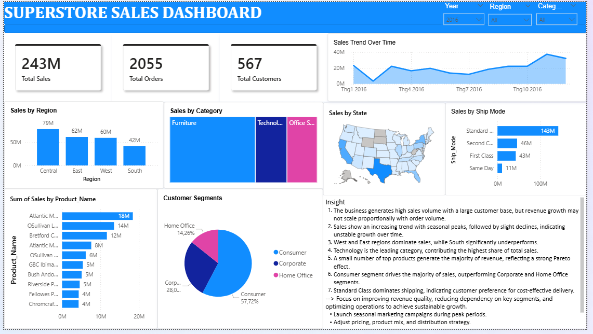

# Sales Performance Analysis & Business Dashboard

Phân tích hiệu quả bán hàng của tập dữ liệu **Superstore (2015–2018)** và xây dựng dashboard trực quan bằng **Power BI** kết hợp **Python (pandas + matplotlib/seaborn)**.



---

## 1. Mục đích của project

Mình làm project này để trả lời một câu hỏi rất thực tế mà bất kỳ doanh nghiệp bán lẻ nào cũng gặp:

> *Doanh thu đang đến từ đâu, đang đi theo hướng nào, và chỗ nào đang bị bỏ phí?*

Cụ thể, mục tiêu của mình gồm:

- Luyện toàn bộ quy trình của một bài phân tích dữ liệu kinh doanh: từ dữ liệu thô → làm sạch → khám phá (EDA) → trực quan hóa → rút ra kết luận có thể hành động được.
- So sánh hai hướng tiếp cận trực quan hóa: **dashboard tương tác (Power BI)** cho người dùng nghiệp vụ, và **biểu đồ tĩnh bằng Python** cho báo cáo/phân tích chuyên sâu.
- Tập diễn giải số liệu thành *insight kinh doanh* chứ không chỉ dừng ở việc vẽ biểu đồ cho đẹp.

Đây là project cá nhân, mình tự chọn dataset và tự đặt câu hỏi phân tích, nên phần "kể chuyện bằng dữ liệu" là thứ mình đầu tư nhiều nhất.

---

## 2. Dữ liệu

| Thông tin | Chi tiết |
|---|---|
| Nguồn | Sample Superstore Dataset (bán lẻ Mỹ) |
| File | `superstore_final_dataset.csv` |
| Số dòng | 9.800 dòng giao dịch |
| Khoảng thời gian | 2015 – 2018 |
| Số đơn hàng | 4.922 |
| Số khách hàng | 793 |
| Tổng doanh thu | ~2,26 triệu USD |

**Các trường chính:** `Order_Date`, `Ship_Date`, `Ship_Mode`, `Customer_ID`, `Segment`, `City`, `State`, `Region`, `Category`, `Sub_Category`, `Product_Name`, `Sales`.

**Xử lý dữ liệu:** chuẩn hóa kiểu ngày tháng (`Order_Date` → datetime), tách thêm cột `Year` và `Month` để phân tích theo thời gian, xử lý encoding `latin-1` và một số giá trị thiếu ở `Postal_Code`.

---

## 3. Nội dung project

### 3.1. Dashboard Power BI (`SuperStore.pbix`)

Một trang dashboard tổng quan, có bộ lọc theo **Year / Region / Category**, gồm:

- 3 thẻ KPI: Total Sales, Total Orders, Total Customers
- Sales Trend Over Time (đường + vùng)
- Sales by Region, Sales by Category (treemap)
- Bản đồ Sales by State
- Sales by Ship Mode
- Top sản phẩm theo doanh thu
- Customer Segments (pie)
- Một khung **Insight** viết trực tiếp trên dashboard, tóm tắt kết luận và khuyến nghị

### 3.2. Phân tích bằng Python (`Visualize.ipynb`)

8 biểu đồ được vẽ lại bằng pandas + matplotlib + seaborn, theo một bảng màu dark theme thống nhất:

| # | Biểu đồ | Câu hỏi trả lời |
|---|---|---|
| 1 | Doanh thu theo tháng (2015–2018) | Xu hướng và tính mùa vụ ra sao? |
| 2 | Doanh thu theo Category | Nhóm hàng nào đang gánh doanh thu? |
| 3 | Doanh thu theo Region | Vùng nào mạnh, vùng nào yếu? |
| 4 | Doanh thu theo Segment (donut) | Khách hàng chủ lực là ai? |
| 5 | Doanh thu theo Sub-Category | Nhóm hàng con nào đáng đầu tư? |
| 6 | Phương thức vận chuyển (donut) | Khách chọn giao hàng kiểu gì? |
| 7 | Doanh thu theo Năm × Category | Nhóm hàng nào tăng trưởng ổn định? |
| 8 | Top 10 tiểu bang | Thị trường trọng điểm nằm ở đâu? |

Toàn bộ ảnh kết quả nằm trong thư mục `img/`.

---

## 4. Một số kết quả chính

- **Doanh thu tăng trưởng nhưng không đều.** Hai năm đầu gần như đi ngang (479K → 459K USD), sau đó bật lên rõ ở 2017 và 2018 (600K → 722K USD). Đồ thị theo tháng cho thấy đỉnh lặp lại vào các tháng cuối năm — dấu hiệu mùa vụ khá rõ.
- **Technology dẫn đầu doanh thu** (~827K USD), theo sau là Furniture (~729K) và Office Supplies (~705K). Khoảng cách giữa ba nhóm không quá lớn, nhưng Technology có biên tăng trưởng tốt hơn theo năm.
- **West và East chiếm hơn 60% doanh thu**, trong khi South chỉ đóng góp khoảng 17% — chênh lệch vùng miền rất đáng chú ý.
- **Phụ thuộc mạnh vào một vài thị trường:** riêng California và New York đã chiếm gần 1/3 tổng doanh thu.
- **Consumer là phân khúc chủ lực** (~51%), Corporate ~30%, Home Office ~19%.
- **Standard Class chiếm gần 60% doanh thu vận chuyển**, cho thấy khách hàng ưu tiên chi phí hơn tốc độ giao hàng.
- Ở cấp Sub-Category, **Phones và Chairs** là hai nhóm bán chạy nhất — hiệu ứng Pareto khá điển hình, một nhóm nhỏ sản phẩm tạo ra phần lớn doanh thu.

**Hàm ý kinh doanh:** nên đẩy chiến dịch marketing vào mùa cao điểm cuối năm, xem lại chiến lược phân phối ở khu vực South, và giảm bớt sự phụ thuộc vào một vài bang/nhóm sản phẩm chủ lực.

---

## 5. Cấu trúc thư mục

```
Superstore_dashboard/
├── SuperStore.pbix                  # File dashboard Power BI
├── dashboard.png                    # Ảnh chụp dashboard
├── Visualize.ipynb                  # Notebook phân tích & vẽ biểu đồ
├── superstore_final_dataset.csv     # Dữ liệu đã làm sạch
└── img/                             # Các biểu đồ xuất từ notebook
    ├── 01_monthly_trend.png
    ├── 02_category_sales.png
    ├── 03_region_sales.png
    ├── 05_subcategory_sales.png
    ├── 06_shipmode_donut.png
    ├── 07_yearly_category.png
    └── 08_top10_states.png
```

---

## 6. Cách chạy

```bash
git clone https://github.com/VnKhnh/Sales-Performance-Analysis-Business-Dashboard-.git
cd Sales-Performance-Analysis-Business-Dashboard-
pip install pandas matplotlib seaborn jupyter
jupyter notebook Visualize.ipynb
```

> Lưu ý: trong notebook, đường dẫn đọc file và đường dẫn lưu ảnh đang trỏ tới ổ `D:` trên máy mình. Nếu chạy ở máy khác thì sửa lại thành đường dẫn tương đối (`superstore_final_dataset.csv` và `img/...`).

File `.pbix` mở bằng **Power BI Desktop**.

---

## 7. Công nghệ sử dụng

`Python` · `pandas` · `matplotlib` · `seaborn` · `Jupyter Notebook` · `Power BI Desktop`

---

## 8. Hướng phát triển tiếp

- Bổ sung cột Profit / Discount để phân tích **lợi nhuận** chứ không chỉ doanh thu (dataset hiện tại mới có `Sales`).
- Phân tích khách hàng bằng **RFM** và tính retention theo cohort.
- Dự báo doanh thu các tháng tiếp theo bằng mô hình chuỗi thời gian (ARIMA / Prophet).
- Tách phần xử lý dữ liệu ra thành script riêng để notebook chỉ còn phần trực quan hóa.

---

*Project thực hiện bởi [VnKhnh](https://github.com/VnKhnh).*
